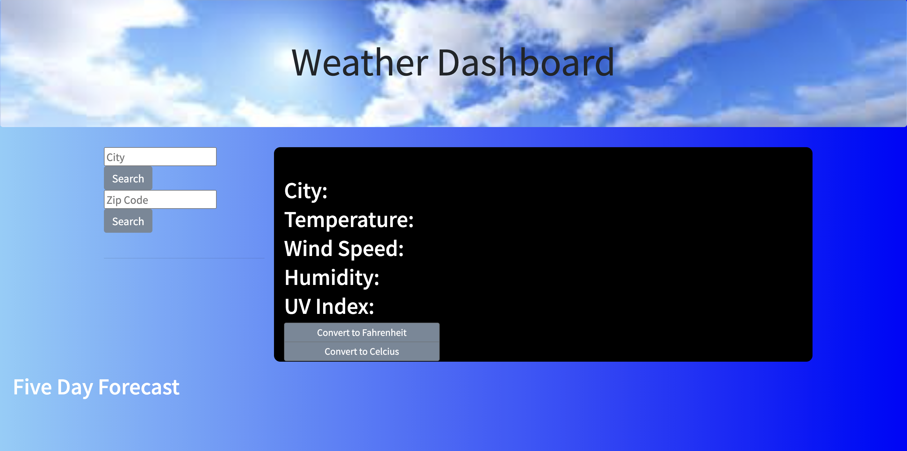

# weatherDashboard

This weather application allows user to retrieve weather data either by City or Zipcode for the location of their choice.  It uses OpenWeather API to accurately present the current weather and forecast for up to five days.

## Key Features

* The user has the ability to search for a location by either city or zipcode.

* The current conditions for that location are displayed.

* Today's date along with the location name, temperature, weather icon and weather conditions including the wind speed and UV index are shown.

* The UV index will change background color depending on the ranking of favorable, moderate or severe.

*  The five day forecast for that location will be shown as the bottom of the page.

* The search history will be created and shown as buttons on the side panel.

* The search history buttons will bring the user back to that weather forecast when clicked.

* When the page is refreshed, the most recent location searched will be shown in the page.

* The searches will be saved in local storage.

### How to Use

* The user first enters either a city or zipcode.

* After it is entered the weather and the five day forecast will appear.

 

* The application will save the search history that was rendered and save the last search to render to the page when it is reloaded.

#### Link to page

Below is a link to the application.

https://dargenioa.github.io/weatherDashboard/
